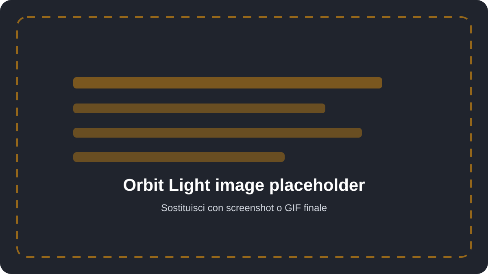

# HDRI Environment

La sezione **HDRI Environment** controlla illuminazione e sfondo panoramico. Orbit Light usa una texture HDRI nel World, non una lampada, per l'illuminazione ambientale.

  

## Scegliere una HDRI

L'anteprima usa il picker Studio Light nativo di Blender. Un clic apre l'elenco delle HDRI disponibili e la scena si aggiorna alla selezione.

Il campo **HDRI** accetta un file environment. **Import HDRI Folder** importa una cartella nella libreria Studio Light di Blender, così le immagini rimangono disponibili anche nelle sessioni successive.

Formati gestiti: `.hdr`, `.exr`, `.tx`, `.jpg`, `.jpeg` e `.png`.

## Controlli

| Controllo | Funzione |
|---|---|
| **Environment Opacity** | Cambia la visibilità dello sfondo senza ridurre la luce sul modello. |
| **Environment Intensity** | Moltiplica la forza luminosa dell'HDRI da 0 a 10. |
| **Environment Blur** | Usa il blur nativo di Material Preview. Non modifica il file HDRI. |
| **Environment Rotation** | Ruota l'ambiente sull'asse orizzontale. |
| **Sensitivity** | Imposta i gradi applicati per ogni pixel trascinato. |
| **Drag Target** | Sceglie cosa controllare con Shift + trascinamento destro. |
| **Shadows** | Attiva o disattiva le ombre mantenendo invariati HDRI e preset luce. |

I valori iniziali sono: Opacity **100%**, Intensity **1.0**, Blur **100%**, Rotation **0°** e Shadows **attive**.

## Opacità e illuminazione

**Environment Opacity** separa lo sfondo dall'illuminazione. A `0%` lo sfondo non è visibile, ma riflessi e luce HDRI restano attivi. Per ridurre davvero la luce usa **Environment Intensity**.

## Blur

Il blur è pensato per il lookdev veloce in Material Preview. Ammorbidisce soltanto la rappresentazione dell'ambiente; non sfoca le texture del modello e non riscrive l'HDRI.

## Ombre

La spunta **Shadows** sincronizza il controllo ombre della scena e del viewport. Disattivandola, le luci del rig restano accese e mantengono colori, intensità e preset; cambia soltanto la produzione delle ombre.
