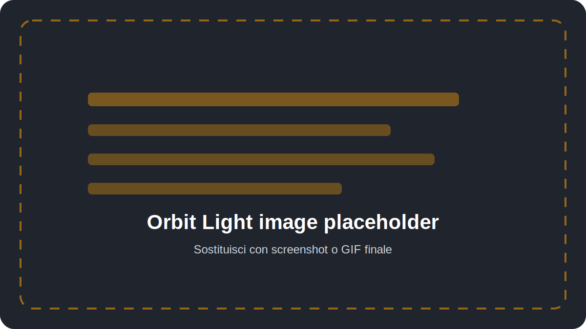

# Orbit Light

Orbit Light è un addon Blender per controllare illuminazione HDRI ed environment lighting in modo rapido, con un comportamento vicino a Substance Painter e Sketchfab.

  

---

## Cosa fa

Orbit Light crea e aggiorna un setup World HDRI per illuminare il modello in Material Preview.

È pensato per artisti che vogliono ruotare, bilanciare e controllare l'ambiente luminoso senza costruire manualmente nodi world o cambiare continuamente impostazioni sparse in Blender.

## Funzioni principali

- **Create Orbit Light** crea o aggiorna l'illuminazione HDRI e porta Blender nello workspace Shading.
- **HDRI Environment** gestisce immagine HDRI, opacity, exposure, blur, rotation, tilt e alignment.
- **Shift + Right Mouse Drag** ruota l'environment attorno al modello.
- **Shift + Alt + Right Mouse Drag** inclina verticalmente l'HDRI quando Blender espone il controllo nativo.
- **Import HDRI Folder** importa librerie HDRI nel picker nativo di Blender.
- **Shadows** controlla le ombre viewport quando disponibili.
- **Material Maps** regola AO Strength e Normal Strength sui nodi già presenti nei materiali.

---

## Workflow rapido

1. Apri la sidebar del 3D View con **N**.
2. Vai alla tab **Orbit Light**.
3. Scegli una HDRI nel pannello **HDRI Environment**.
4. Clicca **Create Orbit Light**.
5. Ruota l'ambiente con **Shift + Right Mouse Drag**.

[Inizia dalla guida rapida](quick-start.md)